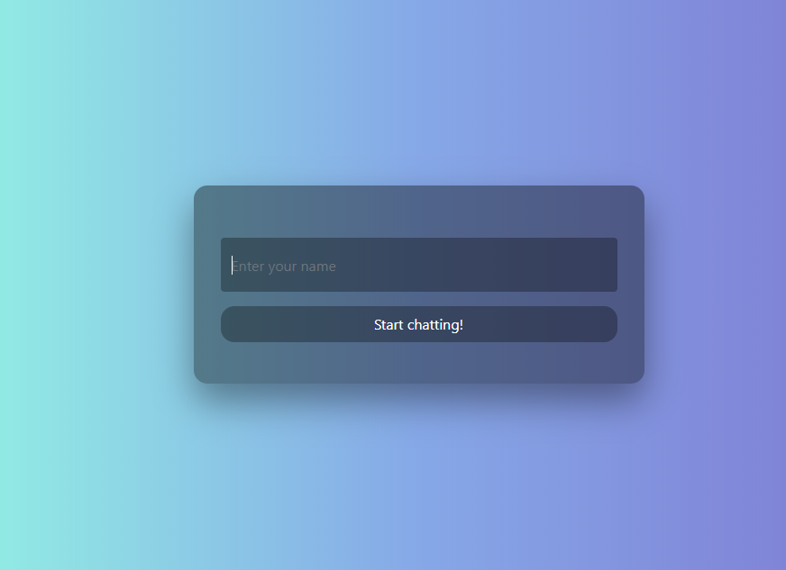
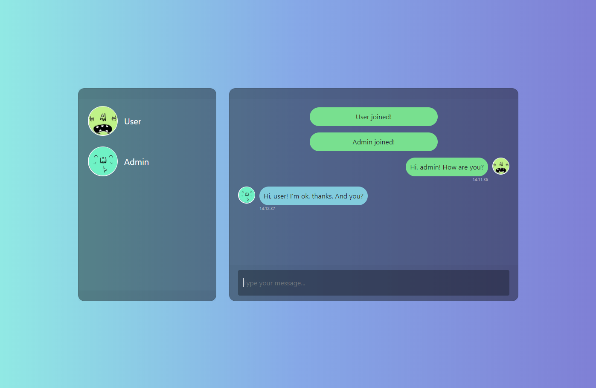

# Chat room application
<p> Simple chat room application with SpringBoot, WebSocket, RabbitMQ and Docker technologies </p>

## Requirements

1. Java - 1.8
2. Maven - 3.x
3. Docker - 19.x

## Steps to Setup

**1. Clone the application**

```bash
https://github.com/nikita-butko/chat-room.git
```

**2. Go to the application folder**

```bash
cd chat-room
```

**3. Build the application**

```bash
mvn install
```

**4. Build and run docker containers**

```bash
docker-compose up
```

**5. Open your favourite internet browser and go to http://localhost:8080/**

**6. Enter your name and start chatting!**



**7. You can open the application in another browser and start chatting with yourself**



**8. For management RabbitMQ use http://localhost:15672/ with login - guest, and password - guest**